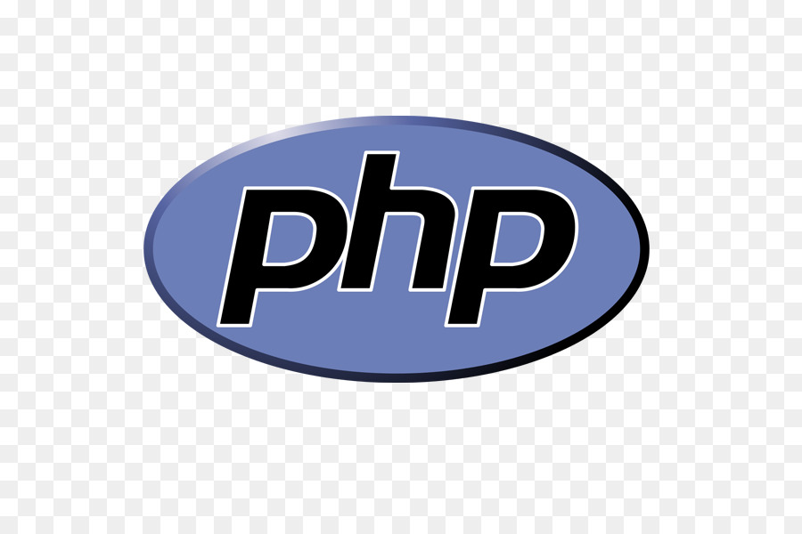

### 👋Salut!

je suis **MARTIN Matthieu**, Je suis un **Développeur Fullstack**.
  

### ⚒&nbsp;&nbsp;&nbsp; je travaille actuellement avec

 &nbsp;&nbsp;&nbsp;&nbsp; &nbsp;&nbsp;&nbsp;&nbsp; &nbsp;&nbsp;&nbsp;&nbsp; &nbsp;&nbsp;&nbsp;&nbsp;&nbsp;&nbsp;&nbsp;&nbsp; &nbsp;&nbsp;&nbsp;&nbsp;

  

